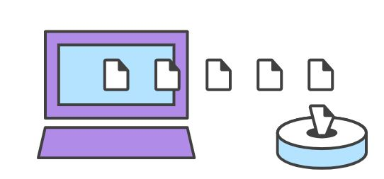
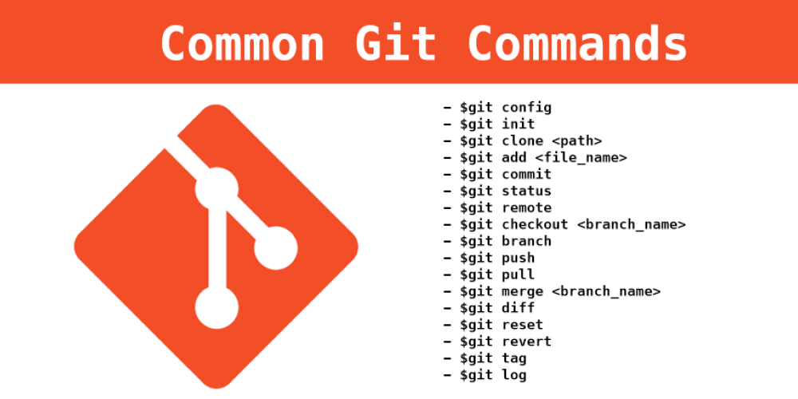
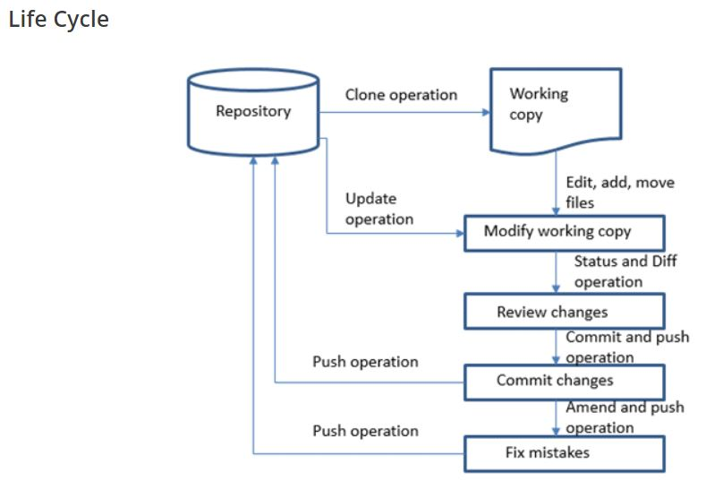

### What is a Git repository?

Git is a DevOps tool that is used as a version-control system for tracking the changes happening in system files and coordinating the work on those files among a group of people. In the software development field, Git is used in source code management and for tracking the changes made in any file.

Git is a distributed version control and source code management system with an emphasis on speed.
It is a repository used to manage projects, the set of files, as they change over time.
Using Git, every code change or commit we make gets updated in the development code of a project.


### Initializing a new repository: git init
```` 
git init .
git init <project directory> 
````

### Cloning an existing repository: git clone
```
git clone <repo url>
```
### Saving changes to the repository: git add and git commit
```
echo "test content for git tutorial" >> CommitTest.txt 
git add CommitTest.txt 
git commit -m "added CommitTest.txt to the repo"
```

### Configuration & set up: git config
```
git remote add <remote_name> <remote_repo_url>     #[To map remote repository]
git push -u <remote_name> <local_branch_name>      #[To push the local repo branch to remote repo]
git config --global user.name <name>     #[Define the author name to be used for all commits in the current repository. Typically, you’ll want to use the --global flag to set configuration options for the current user.]
git config --local user.email <email>  #[Adding the --local option or not passing a config level option at all, will set the user.name for the current local repository.]
git config --global alias.<alias-name> <git-command>  #{Create a shortcut for a Git command]
git config --global alias.ci commit     #[To learn more about git aliases]
git config --global --edit [Open the global configuration file in a text editor for manual editing]
git --global user.name "John Smith" git config --global user.email john@example.com   #[manually edit these values to the exact same effect as git config]
```

### git clone








### Branching and Merging

| Command                                            | Description                                       |
|----------------------------------------------------|---------------------------------------------------|
| git branch                                         | To list branches                                  |
| git branch -a                                      | To list all the branches                          |
| git branch [branch name]                           | To create a new branch                            |
| git branch -d [branch name]                        | To delete a branch                                |
| git push origin –delete [branchName]               | To delete a remote branch                         |
| git checkout -b [branch name]                      | To create a new branch and switch to it           |
| git checkout -b [branch name] origin/[branch name] | To clone a remote branch and switch to it         |
| git checkout [branch name]                         | To switch to a branch                             |
| git checkout –                                     | To switch to the branch last checked out          |
| git checkout — [file-name.txt]                     | To discard the changes made to a file             |
| git merge [branch name]                            | To merge a branch into an active branch           |
| git stash                                          | To stash the changes in a dirty working directory |
| git stash clear                                    | To remove all the stashed entries                 |


### Sharing and Updating Projects
| Command                                                                         | Description                                                                                |
|---------------------------------------------------------------------------------|--------------------------------------------------------------------------------------------|
| git push origin [branch name]                                                   | To push a branch to a remote repository                                                    |
| git push -u origin [branch name]                                                | To push the changes made to a remote repository (-u remembers the branch for the next use) |
| git push origin –delete [branch name]                                           | To delete a remote branch                                                                  |
| git pull                                                                        | To update a local repository to the newest commit                                          |


| Command                                  | Description                       |
|------------------------------------------|-----------------------------------|
| git log                                  | To view the changes made          |
| View changes                             | To view changes (in detail)       |
| git diff [source branch] [target branch} | To preview changes before merging |
| git pull origin [branch name]                                                   | To pull the changes from a remote repository                                               |
| git remote add origin ssh://git@github.com/[username]/[repository-name].git     | To add a remote repository                                                                 |
| git remote set-url origin ssh://git@github.com/[username]/[repository-name].git | To set a repository’s origin branch to SSH                                                 |
